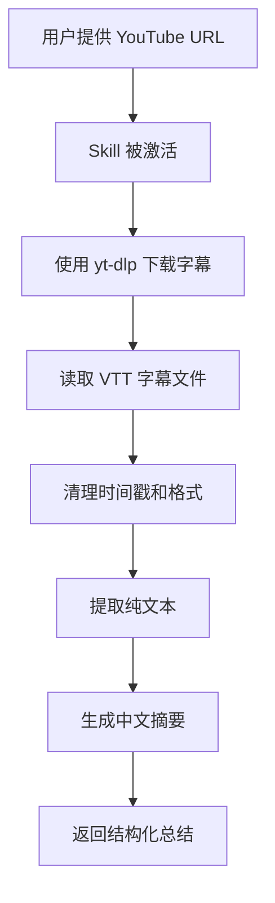

# YouTube 字幕总结 Skill

这是一个 Claude Code 用户级 Skill，用于从 YouTube 视频自动提取字幕并生成中文摘要。

## 📁 文件结构

```
~/.claude/skills/youtube-subtitle-summarizer/
├── SKILL.md               # Skill 定义文件（必需）
├── clean_subtitles.py     # 字幕清理工具（可选）
└── README.md              # 使用说明
```

## 🚀 快速开始

### 1. 验证安装

检查 Skill 是否正确安装：

```bash
ls -la ~/.claude/skills/youtube-subtitle-summarizer/
```

你应该看到：
- ✅ SKILL.md
- ✅ clean_subtitles.py（可执行）
- ✅ README.md

### 2. 测试 Skill

在 Claude Code 中，直接提供 YouTube URL 并请求总结：

```
总结这个 YouTube 视频：https://www.youtube.com/watch?v=qbU7LHPZ4Xo
```

Claude 会自动：
1. 检测到这是 YouTube 字幕总结请求
2. 激活 `youtube-subtitle-summarizer` Skill
3. 下载字幕文件
4. 提取和清理文本
5. 生成中文摘要

### 3. 其他使用方式

```
"请帮我分析这个视频的内容：[YouTube URL]"
"提取并总结这个视频的字幕：[YouTube URL]"
"我想了解这个视频讲了什么：[YouTube URL]"
```

## 🛠️ 手动测试辅助脚本

如果你想单独测试字幕清理脚本：

```bash
# 1. 下载测试字幕
cd /tmp
yt-dlp --write-sub --write-auto-sub --sub-lang zh --skip-download \
  -o "test_subtitle" "https://www.youtube.com/watch?v=qbU7LHPZ4Xo"

# 2. 清理字幕
~/.claude/skills/youtube-subtitle-summarizer/clean_subtitles.py test_subtitle.zh.vtt

# 3. 查看输出
# 纯文本会输出到 stdout，统计信息输出到 stderr
```

## 📋 工作原理

### Skill 激活条件

当你的请求包含以下关键词时，Skill 会自动激活：
- "YouTube" + "总结/摘要/分析"
- "视频" + "字幕"
- YouTube URL 格式

### 执行流程



### 使用的工具

- **Bash**: 执行 yt-dlp 命令
- **Read**: 读取字幕文件
- **Glob**: 查找下载的字幕文件

## ⚙️ 配置

### 权限要求

在 `~/.claude/settings.json` 中，需要有以下权限：

```json
{
  "permissions": {
    "allow": [
      "Bash(yt-dlp:*)"
    ]
  }
}
```

### 依赖检查

确保 yt-dlp 已安装：

```bash
# 检查版本
yt-dlp --version

# 如果未安装，使用 Homebrew 安装
brew install yt-dlp

# 或使用 pip
pip3 install yt-dlp
```

## 🔍 故障排除

### Skill 没有被激活

**症状**：Claude 没有使用 Skill，而是手动执行命令

**解决方案**：
1. 检查 SKILL.md 文件是否存在：
   ```bash
   cat ~/.claude/skills/youtube-subtitle-summarizer/SKILL.md
   ```

2. 验证 YAML frontmatter 格式正确（三个破折号 `---`）

3. 确保 `description` 字段包含相关关键词

4. 尝试更明确的请求，例如：
   ```
   使用 YouTube 字幕总结 Skill 来分析这个视频
   ```

### yt-dlp 下载失败

**症状**：提示需要登录或验证

**解决方案**：
```bash
# 使用浏览器 cookies
yt-dlp --cookies-from-browser chrome --write-sub ...

# 更新 yt-dlp
brew upgrade yt-dlp
```

### 字幕文件找不到

**症状**：下载成功但无法读取字幕

**解决方案**：
1. 检查当前目录的字幕文件：
   ```bash
   ls -la *.vtt *.srt
   ```

2. 使用 Glob 工具查找：
   ```
   在 Claude Code 中使用 Glob 查找 "*.vtt" 或 "*.srt"
   ```

## 📚 扩展功能

### 支持更多语言

修改 SKILL.md 中的字幕下载命令：

```bash
# 优先下载英文字幕
yt-dlp --write-sub --sub-lang en,zh-Hans,zh-Hant ...

# 或只下载特定语言
yt-dlp --write-sub --sub-lang en ...
```

### 自定义摘要格式

在 SKILL.md 中添加摘要模板指令，例如：

```markdown
## 摘要格式要求

请按照以下格式生成摘要：
1. 视频标题和时长
2. 主要章节（3-5个）
3. 核心观点（5-10条）
4. 实用建议
5. 总结（1-2句话）
```

## 🎯 最佳实践

1. **明确请求**：清楚地表达你想要总结 YouTube 视频
2. **提供完整 URL**：使用完整的 YouTube 链接
3. **等待处理**：字幕下载和总结需要一些时间
4. **检查输出**：确保摘要准确反映视频内容

## 🆘 获取帮助

如果遇到问题：

1. 检查 Claude Code 日志
2. 手动测试 yt-dlp 命令
3. 验证 Skill 文件格式
4. 查看 Claude Code 文档：https://github.com/anthropics/claude-code

## 📝 更新日志

- **v1.0** (2025-11-28): 初始版本
  - 支持中文字幕下载
  - 生成结构化中文摘要
  - 包含字幕清理脚本

---

**作者**: Claude Code User
**最后更新**: 2025-11-28
